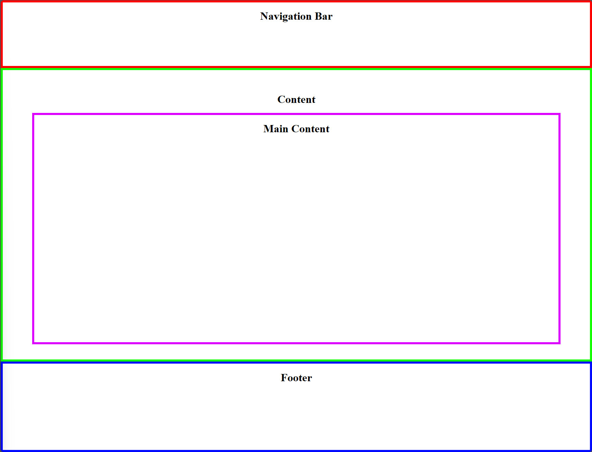
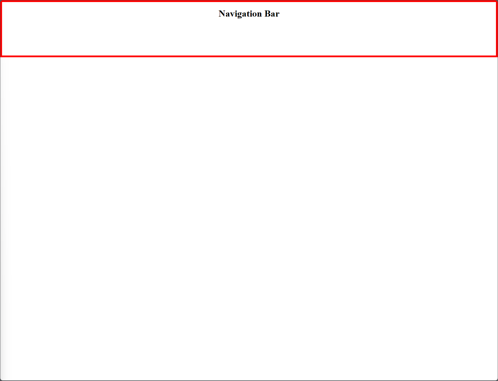
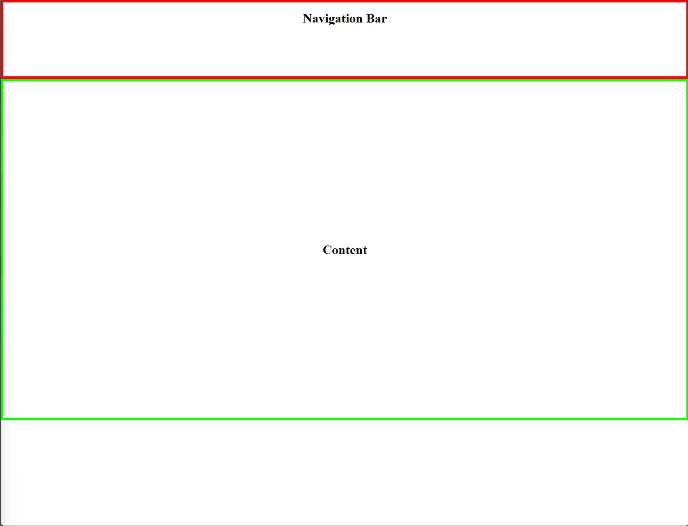
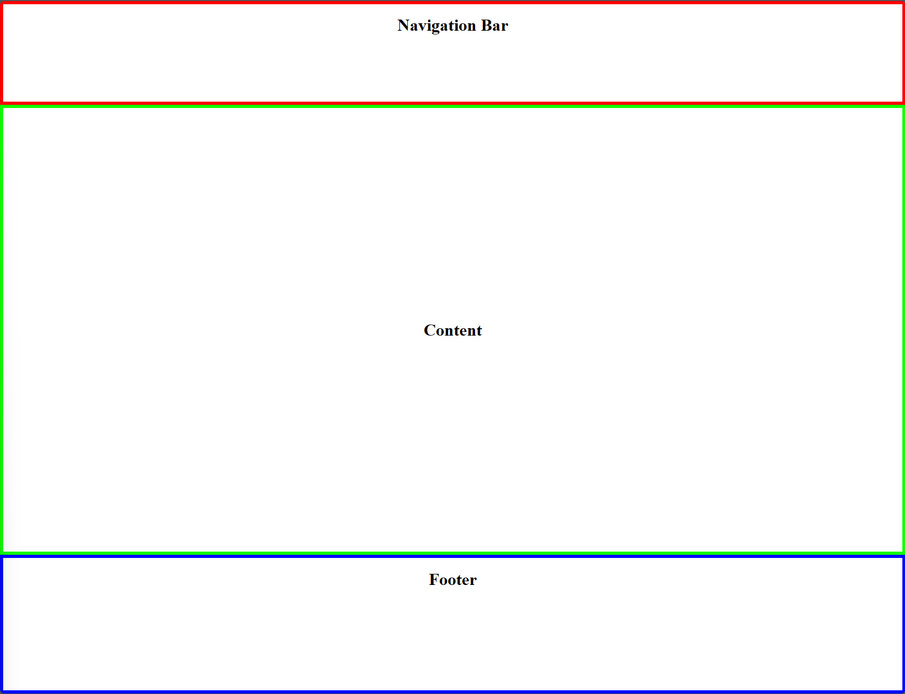

### React Webpage Layout Assignment

#### Overview
This assignment involves creating a React application that replicates the provided webpage layout with distinct areas for navigation, content, and a footer.

#### Assignment Details
This assigmnent should be done entirely in [App.js](./basic-app/src/App.js). Create `div` elements for each section of the layout: Navigation Bar, Content, and Footer.

**Part 1: Navigation Bar**

    
Preview

  

 

- Style the navigation bar section with a red border at the top of the page.
- Ensure the navigation bar extends across the full width of the screen.

**Part 2: Content Section**

    
Preview

  

 

- Add a green border around the main content area.
- Ensure it takes up a majority of the screen height

**Part 3: Footer Section**

    
Preview

  

 

- Implement the footer with a blue border and position it at the bottom of the screen.

**Part 4: Main Content Section**

    
Preview

  

 

- Within the content section, create another `div` for the main content area and add a purple border.

- The size ratios of the different sections should match the provided [example](./Example/Part4.png).

- Use inline styles or a separate CSS file to apply styles to your layout.
- Ensure the layout is responsive and remains consistent on various devices.

